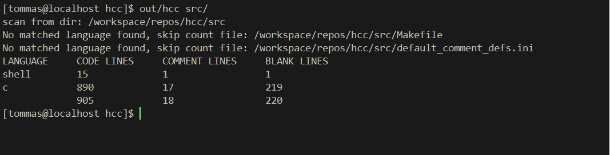
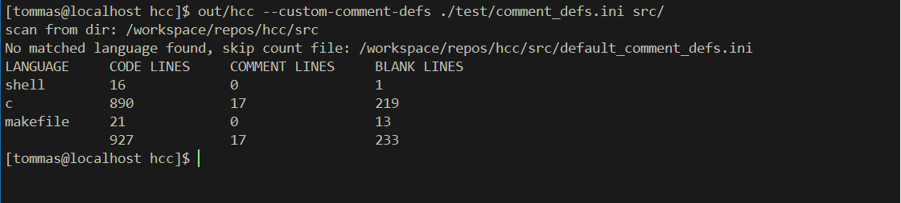

## Husky Codes Counter

hcc is a flexible codes counter

* hcc can tell you how many code lines, comment lines and blank lines in the file or directory you specified
* hcc can give you the result by each file, each language and in total
* hcc is aimed to be flexible to support all kinds of languages

### Basic Usage
<p align="center">

</p>

### Customize language support
There a two way to customize your own languages support

1. modify `src/default_comment_defs.ini` file and build hcc.
2. use custom-comment-defs option
<p align="center">

</p>

Check `src/default_comment_defs.ini` file to see customize language
ini file format details

### Options
* custom-comment-defs=FILE
> define own comment definition
* comment-defs-detail
> show comment definition detail
* exclude=PATTERN
> skip count files matching PATTERN
* exclude-from=FILE
> skip count files matching any pattern from FILE(separate by new line)
* -v, --verbose
> show verbose result
* version
> version number
* h, --help
> this help text

### Build
``` bash
$ make
```
